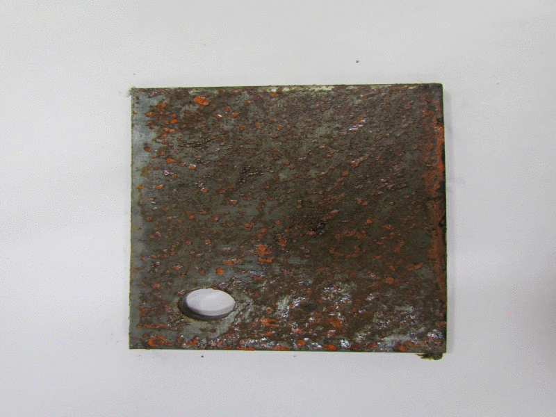

# Rust Detection Algorithm


 


The rust detection algorithm uses colour based image processing technique to detect and segment 

the region of metal affected by rust. I developed this code for my friend who was studying 

the effect of a solution on different metals to preventing rusting.


Using the algorithm, it was easy to compare the number of pixels corresponding to

rusted area of metal. Since the arrangement of camera while taking the image is fixed, comparison 

directly in terms of pixels will work well.


>- You can learn some key functions of opencv from this code. 

>- Refer a detailed [Tutorial](Tutorial.md) explaining the [code](Rust_Detection.py).


---


## Installation


#### Clone


- Clone this repo to your local machine using `https://github.com/kaustubh-Beta/Rust-detection-algorithmm.git`


#### Setup/Requirements


> The code is written in Python (`Python3`)

> You need the following libraries

> - numpy

> - OpenCV

---
**Installing the pip package** 
```pip install rust-detect```
```
from rust_detect.detect_rust import Rust_Detection
detect=Rust_Detection().rust_detect("Image name")
```

##### Refer the [Tutorial](Tutorial.md) for detailed explanation of the code.


## License


[](http://badges.mit-license.org)


- **[MIT license](http://opensource.org/licenses/mit-license.php)**


